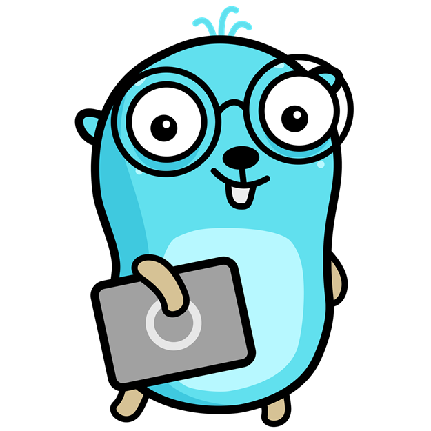

# Go Save Eyes



*Gopher image by [MariaLetta](https://github.com/MariaLetta), licensed under
[Creative Commons Zero v1.0 Universal](https://creativecommons.org/publicdomain/zero/1.0/).*

## Download and Install

If you are not technical person just click this link:
[Download Go Save Eyes](
https://github.com/MateuszKepczynski/Go-Save-Eyes/releases/download/v0.1.2/go-save-eyes.exe
)
and run .exe file.
If you are more aware

## About Go Save Eyes

Go Save Eyes is an open-source software designed to help users maintain healthy
eye habits by reminding them to take regular breaks and rest their eyes while
working on digital devices. Prolonged screen time can lead to eye strain,
fatigue, and potential long-term vision issues. This application aims to address
these concerns by providing a simple and customizable solution. Key Features:

- **Visual Reminder**: visual notifications on the screen to ensure that users
  don't miss their scheduled breaks.
- **Interval Recommendations**: The application suggests optimal intervals for
  resting the eyes based on established
  eye care guidelines, considering factors like screen brightness, distance from
  the screen, and the type of work being performed.
- **User-Friendly Interface**: Simple ready-to-go interface!
- **Open Source**:  is an open-source project, fostering community involvement,
  transparency, and the potential for
  continuous improvement and customization by developers and users.

## Minimum Requirements

Fyne is required to build execute file - [how to install fyne](https://developer.fyne.io/started/)

- Set Go environment variable:

    ```shell
    $env:CGO_ENABLED=1
    ```

Application was build on Windows but shares the same
[minimum requirements](
https://github.com/golang/go/wiki/MinimumRequirements#minimum-requirements
) as Go:

- Linux kernel version 2.6.23 or later
- Windows 7 or later
- FreeBSD 11.2 or later
- MacOS 10.11 El Capitan or later

## Running Go Save Eyes locally

### Running application

```shell
go run main.go
```

### Building execute file

#### Windows

```shell
go build -ldflags="-H windowsgui" -o go-save-eyes.exe
```

#### Linux

TBD

#### MacOS

TBD

### Configuring pre-commit

```shell
pip install pre-commit
```

```shell
pre-commit install --hook-type commit-msg
```
